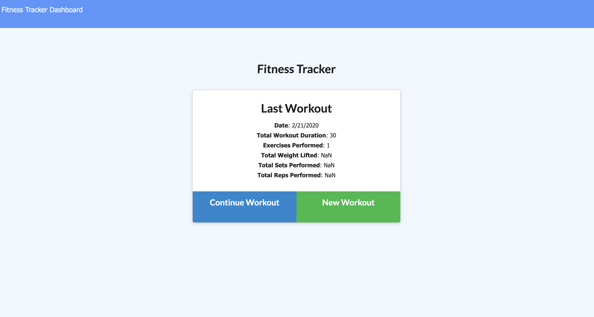
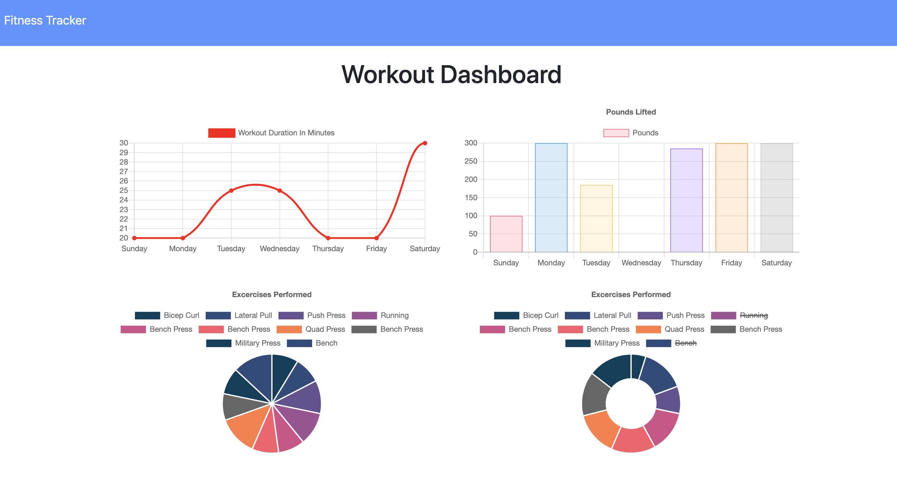

# Workout-Tracker
Workout tacker, want a better way to keep track of your workouts? Perhaps see real data of what you're actually doing in the gym? This workout tracker makes it easy to visualize how much you do or do not do. From the landing page you can view your latest workout and add to it, or you can start a new workout by hitting the new workout button. At the top, click dash board and see where all of your time working out is spent via graphs.

View my deployed application here:

<a href="https://enigmatic-castle-34609.herokuapp.com">Heroku Eat Da Burger</a>