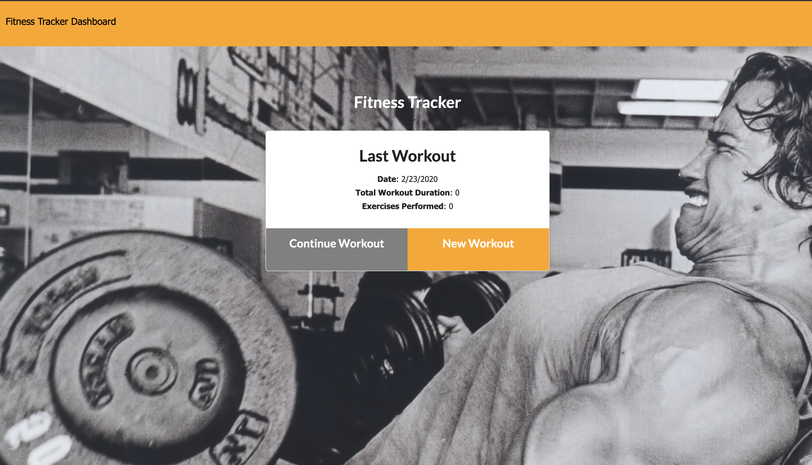
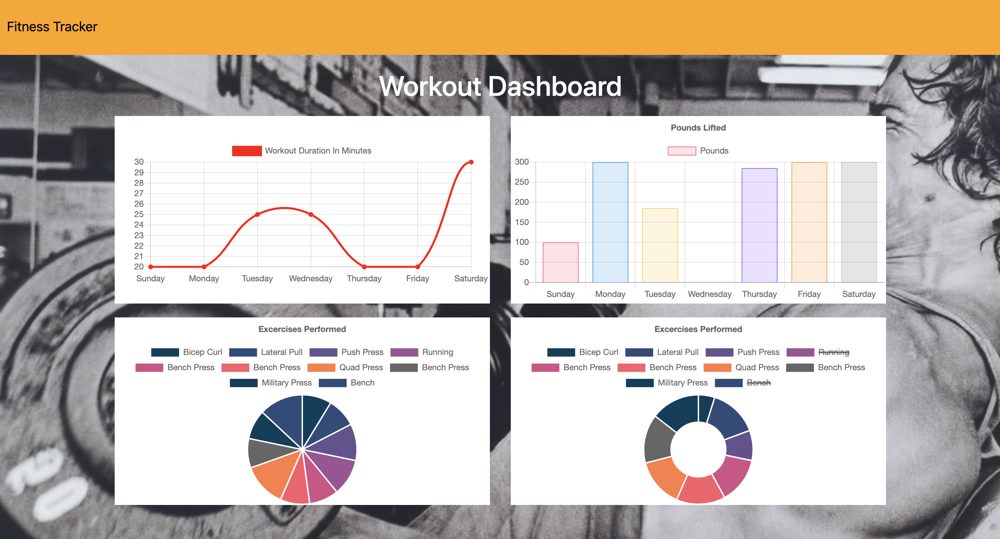

# Workout-Tracker

## User Story

As a user, I want to be able to view create and track daily workouts. I want to be able to log multiple exercises in a workout on a given day. I should also be able to track the name, type, weight, sets, reps, and duration of exercise. If the exercise is a cardio exercise, I should be able to track my distance traveled.

## Business Context
A consumer will reach their fitness goals quicker when they track their workout progress.

## Summary
Workout tacker, want a better way to keep track of your workouts? Perhaps see real data of what you're actually doing in the gym? This workout tracker makes it easy to visualize how much you do or do not do. From the landing page you can view your latest workout and add to it, or you can start a new workout by hitting the new workout button. At the top, click dash board and see where all of your time working out is spent via graphs.

## How It Works
When the users first access the site, the user will be shown a summary of their last workout. They then can either continue a previous workout or start a new workout. Once the decision has been made to either continue a workout or start a new one, the user can then select the type of workout and enter in the details of the workout to follow. In the top left corner is a link to view statistics of the workouts & to see how they are either delegating their exercises. 

Users are given a few fields to fill out, and a number of consequences will occur when certain buttons are pressed. The possible input areas are:

##Price and Tip values.
The number of individuals to split the bill by
Payment through cash, credit, or check.
If credit is selected, additional menus prompting the user to input their credit card and CVV number will be given. A validate button with the user's card information will then appear to allow for the user to check if their card works

It just checks to make sure that the format is valid - make sure the dropdown menu matches your card provider (i.e. Visa, MasterCard)if you want to try it out!

View my deployed application here:

<a href="https://secure-retreat-62883.herokuapp.com/?id=5e52989c5665690017b4c913">Heroku Workout Tracker</a>